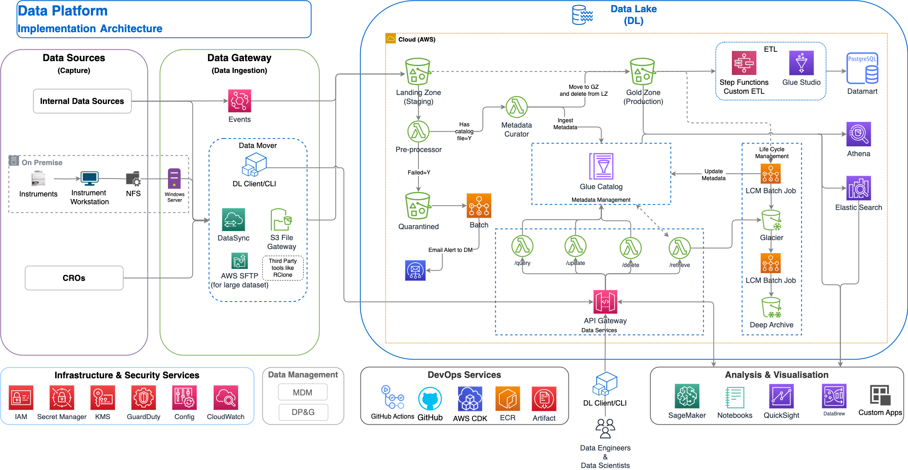
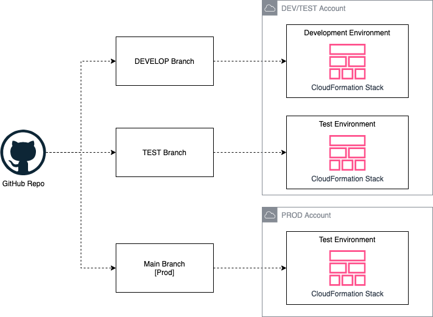
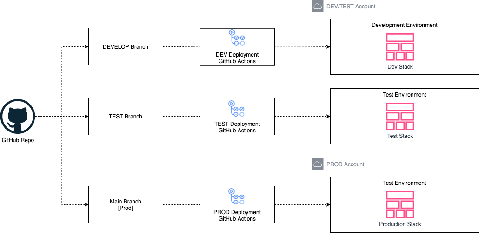
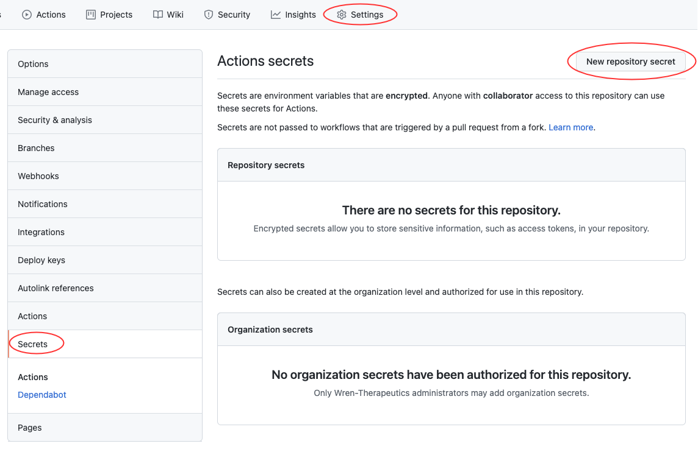

# Data Platform Infrastructure Deployment

This solution helps to build and deploy data lake infrastructure on AWS using AWS CDK.
CDK stands for Cloud Development Kit. It is an open source software development framework to define your cloud application resources using familiar programming languages.

This solution helps you:

1. deploy data lake infrastructure on AWS using CDK
1. increase the speed of prototyping, testing, and deployment of new ETL workloads

---

## Contents

- [Data Platform](#data-platform)
  - [Architecture](#architecture-overview)
  - [Infrastructure](#infrastructure)
- [Deployment Architecture](#deployment-architecture)
  - [Continuous delivery of data lake infrastructure](#continuous-delivery-of-data-lake-infrastructure-using-github-actions)
  - [Source code structure](#source-code-structure)
  - [Automation scripts](#automation-scripts)
- [Prerequisites](#prerequisites)
  - [Software installation](#software-installation)
  - [Logistical requirements](#logistical-requirements)
  - [AWS environment bootstrapping](#aws-environment-bootstrapping)
  - [Application configuration](#application-configuration)
  - [CI/CD - GitHub Actions integration](#github-actions-integration)
- [Deployment](#deployment)
  - [Deploying for the first time](#deploying-for-the-first-time)
- [Data lake ETL jobs](#data-lake-etl-jobs)
- [Additional resources](#additional-resources)
  - [Clean up](#clean-up)
  - [AWS CDK](#aws-cdk)
  - [Developer guide](#developer-guide)

---

## Data Platform

In this section explains the Data Platform architecture and its infrastructure.

---

### Architecture Overview

The diagram below shows the MVP version of Data Platform Architecture - DRAFT to enable the phase-wise delivery of the Data Platform.

The Data Lake can have multiple producers which ingest files into the landing zone bucket. The architecture uses AWS Lambda, Glue ETL and AWS Step Functions for orchestration and scheduling of ETL workloads to clean, validate and generate rich metadata. AWS Glue Catalog will be used to store the metadata.

AWS Glue Studio will be used to extract and transform the data into a relational data model and load it into a Data Mart (PostgreSQL or Aurora DB).

We use Amazon Athena for interactive queries and analysis. Also uses various AWS services for logging, monitoring, security, authentication, authorisation, notification, build, and deployment.



---

### Infrastructure

Now we have the Data Lake design, let's deploy its infrastructure. It includes the following resources:

1.  Amazon Virtual Private Cloud (VPC)
1.  Subnet
1.  Security Groups
1.  Route Table(s)
1.  VPC Endpoints
1.  Key Management Service
1.  Amazon S3 buckets for:
    1. Landing Zone (Staging)
    1. Gold Zone (Production/conformed layer)
    1. log buckets
1.  A PostgreSQL DB for a Data Mart and auditing DB
1.  API Gateway

Glue ETL and Lambda functions are created through a separate pipeline.

Figure below represents the infrastructure resources we provision for Data Lake.


### Deployment Architecture

We 2 AWS accounts and that can be used as follows:

1. Dev account for dev and test data lake
1. Prod account for production data lake

Figure below represents the deployment model.



There are few interesting details to point out here:

1. **Data Lake infrastructure source code** is organized into three branches in GitHub - dev, test, and main(prod).
1. Each branch is mapped to a target environment. This way, code changes made to the branches are deployed iteratively to their respective target environment.
1. From CDK perspective, we apply the standard bootstrapping principles which is explained in subsequent sections.

---

### Continuous delivery of infrastructure using GitHub Actions

Figure below illustrates the continuous delivery of data lake infrastructure.

NOTE: This is not implemented yet.



There are few interesting details to point out here:

1. The DevOps administrator checks in the code to the repository.
1. GitHub Actions listens to commit events on the source code repositories.
1. Code changes made to the dev branch of the repo are automatically deployed to the dev environment of the data lake.
1. Code changes to the test branch of the repo are automatically deployed to the test environment.
1. Code changes to the main branch of the repo are automatically deployed to the prod environment.

### Source code structure

Table below explains how this source ode structured:

| File / Folder                                                     | Description                                                                                                                                                         |
| ----------------------------------------------------------------- | ------------------------------------------------------------------------------------------------------------------------------------------------------------------- |
| [app.py](./app.py)                                                | Application entry point.                                                                                                                                            |
| [deploy_stacks.py](lib/deploy_stacks.py)                          | Pipeline deploy stage entry point.                                                                                                                                  |
| [iam_stack.py](lib/iam_stack/iam_stack.py)                        | Contains all resources to created IAM Roles                                                                                                                         |
| [s3_bucket_zones_stack.py](lib/s3_stack/s3_bucket_zones_stack.py) | Stack creates S3 buckets - LandingZone, GoldZone and Log buckets. This also creates AWS KMS Keys to enabled server side encryption for all buckets.                 |
| [lambda_stack.py](lib/lambda_fn_stack/non_func_lambda_fns.py)     | Contains resources for lambda functions                                                                                                                             |
| [tagging.py](./lib/tagging.py)                                    | Program to tag all provisioned resources.                                                                                                                           |
| [vpc_stack.py](lib/vpc_stack/vpc_stack.py)                        | Contains all resources related to the VPC used by Data Lake infrastructure and services. This includes: VPC, Security Groups, and VPC Endpoints( Gateway Endpoint). |
| [glue_stack.py](./lib/glue_stack/glue_stack.py)                   | Contains script to provision AWS Glue resources                                                                                                                     |
| [configuration.py](./lib/configuration.py)                        | Contains all configurations                                                                                                                                         |
| [step_functions](lib/step_functions)                              | Contains all resources related to AWS Step Functions                                                                                                                |
| [lib](./lib)                                                      | The cdk code for deploying stacks                                                                                                                                   |
| [resources](./resources)                                          | This folder has static resources such as architecture diagrams, developer guide etc.                                                                                |
| glue_etl_job_auditor                                              | Folder to keep lambada code for auditing Glue ETL Jobs                                                                                                              |
| glue_etl_script                                                   | Contains a copy of glue ETL scripts                                                                                                                                 |
| [assets](./lib/assets)                                            | Contains assets for S3 deployment (predefined prefixes and default files)                                                                                           |

---

### Automation scripts

This repository has the following automation scripts to complete steps before the deployment:

| #   | Script                                                                                 | Purpose                                                                        |
| --- | -------------------------------------------------------------------------------------- | ------------------------------------------------------------------------------ |
| 1   | [bootstrap_deployment_account.sh](./lib/prerequisites/bootstrap_deployment_account.sh) | Used to bootstrap deployment account (currently this method is not being used) |
| 2   | [bootstrap_target_account.sh](./lib/prerequisites/bootstrap_target_account.sh)         | Used to bootstrap target environments for example dev, test, and production.   |
| 3   | [configure_account_secrets.py](./lib/prerequisites/configure_account_secrets.py)       | Used to configure account secrets for e.g. GitHub access token.                |

---

## Prerequisites

This section has various steps you need to perform before you deploy data lake resources on AWS.

---

### Software installation

1. **AWS CLI** - make sure you have AWS CLI configured on your system. If not, refer to [Configuring the AWS CLI](https://docs.aws.amazon.com/cli/latest/userguide/cli-chap-configure.html) for more details.

1. **AWS CDK** - install compatible AWS CDK version

   ```bash
   npm install -g aws-cdk
   ```

1. **Python** - make sure you have Python SDK installed on your system. We recommend Python 3.7 and above.

### Other requirements

1. **AWS accounts.** recommend to have at least three accounts for dev, test, and prod accounts. To test this solution with one target environment for e.g. dev, refer to [developer_instructions.md](./resources/developer_instructions.md) for detailed instructions.

1. **Number of branches on your GitHub repo** - the main to start with and dev and test branches can be added at the beginning or after the first deployment of data lake infrastructure in PROD environment.

1. **Administrator privileges** - you need to administrator privileges to bootstrap AWS environments and complete initial deployment. Usually, these steps can be performed by a DevOps administrator of your team. After these steps, you can revoke administrative privileges. Subsequent deployments are based on self-mutating natures of CDK Pipelines.

1. **AWS Region selection** - if possible use the same AWS region (e.g. eu-west-2) for dev, test, and prod accounts for simplicity.

---

### AWS environment bootstrapping

Environment bootstrap is standard CDK process to prepare an AWS environment ready for deployment. Follow the steps:

1.  Go to project root directory where [app.py](app.py) file exists

2.  Create Python virtual environment. This is a one-time activity.

    ```bash
    python3 -m venv .venv
    ```

3.  Activate Python virtual environment

    ```bash
    source .venv/bin/activate
    ```

4.  Install dependencies

    ```bash
    pip install -r requirements.txt
    ```

5.  Expected output: run the below command and verify all dependencies are installed

    ```bash
    ls -lart .venv/lib/python3.9/site-packages/
    ```

    **Important**:

    1. This command is based on the feature [Named Profiles](https://docs.aws.amazon.com/cli/latest/userguide/cli-configure-profiles.html).
    1. Configure [AWS CLI to use AWS SSO](https://docs.aws.amazon.com/cli/latest/userguide/cli-configure-sso.html) to login using SSO via CLI.

6.  Before you bootstrap **dev** account, set environment variable

    ```bash
    export ENV=Dev
    ```

7.  Bootstrap **dev** account

    **Important:** Your configured environment _must_ target the Dev account

    ```bash
    cdk bootstrap aws://<dev account>/<region> --profile <your aws profile to Dev>
    ```

    When you see the following text, enter **y**, and press enter/return

8.  Expected outputs:

    1. In your terminal, you see ✅ Environment aws://account/eu-west-2 bootstrapped.

9.  You see an S3 bucket created in account. The name is like `cdk-hnb659fds-assets-<dev_account_id>-<region>`

10. Before you bootstrap **test** account, set environment variable

    ```bash
    export ENV=Test
    ```

11. Bootstrap test account

    **Important:** Your configured environment _must_ target the Test account

    ```bash
    cdk bootstrap aws://<test account>/<region> --profile <your aws profile to Test>
    ```

12. Expected outputs:

    1.  In your terminal, you see ✅ Environment aws://test_account_id/aws-region bootstrapped.

    1.  You see an S3 bucket created in central deployment account. The name is like `cdk-hnb659fds-assets-<test_account_id>-<aws-region>`

13. Before you bootstrap **prod** account, set environment variable

    ```bash
    export ENV=Prod
    ```

14. Bootstrap Prod account

    **Important:** Your configured environment _must_ target the Prod account

    ```bash
    cdk bootstrap aws://<Prod account>/<region> --profile <your aws profile to Prod>
    ```

15. Expected outputs:

    1.  In your terminal, you see ✅ Environment aws://prod_account_id/aws-region bootstrapped.

    1.  You see an S3 bucket created in central deployment account. The name is like `cdk-hnb659fds-assets-<prod_account_id>-<aws-region>`

---

### Application configuration

Before we deploy our resources we must provide the manual variables and upon deployment the CDK Pipelines will programmatically export outputs for managed resources. Follow the below steps to setup your custom configuration:

1. **Note:** You can safely commit these values to your repository

1. Go to [configuration.py](./lib/configuration.py) and make sure the values under `local_mapping` dictionary within the function `get_local_configuration` are correct for the environments.

---

### GitHub Actions integration

GitHub Actions requires a AWS IAM user Access Key and Secret Access Key to deploy stack to the environment. This access token is stored in GitHub Secrets. For security reason, the key must be rotated periodically. Follow the below steps:

1.  **Note:** Do **NOT** commit these values to your repository

1.  Go to GitHub repository and on Settings tab, and create below entries
    _ AWS_ACCESS_KEY_ID
    _ AWS_SECRET_ACCESS_KEY
    

---

## Deployment

This section explains the steps to deploy the stack in different environments.

---

### Deploying for the first time

Configure your AWS profile to target the Deployment account as an Administrator and perform the following steps:

1. Open command line (terminal)
1. Go to project root directory where `cdk.json` and `app.py` exist
1. Run the command `cdk ls`
1. Expected output: It lists CDK Pipelines and target account stacks on the console. A sample is below:

```bash
  Dev/DevDataLakeInfrastructureS3BucketZones
  Dev/DevDataLakeInfrastructureVpc
  Test/TestDataLakeInfrastructureS3BucketZones
  Test/TestDataLakeInfrastructureVpc
```

1. Run the command for deploy all stacks to all environment
   ```
   cdk deploy --all --profile <your aws profile name>
   ```
1. Run below command to deploy a specific stack to specific env

   ```
   cdk deply <stack id> --profile <your aws profile name>
   e.g. cdk deploy Dev/DevDataLakeInfrastructureS3BucketZones --profile <your aws profile name>

   ```

1. Expected outputs:

   In the DEV account's CloudFormation console, you will see the following stacks are completed successfully

   

---

## Additional resources

### Clean up

1. Delete stacks using the command `cdk destroy --all`. When you see the following text, enter **y**, and press enter/return.

   ```bash
   Are you sure you want to delete: TestDataLakeKInfrastructurePipeline, ProdDataLakeInfrastructurePipeline, DevDataLakeInfrastructurePipeline (y/n)?
   ```

   Note: This operation deletes stacks only in central deployment account

1. To delete stacks in **development** account, log onto Dev account, go to AWS CloudFormation console and delete the following stacks:

   1. Dev-DataLakeInfrastructureVpc
   1. Dev-DataLakeInfrastructureS3BucketZones
   1. Dev-DataLakeInfrastructureIam

   **Note:**

   1. Deletion of **Dev-DevDataLakeCDKInfrastructureS3BucketZones** will delete the S3 buckets (raw, conformed, and purpose-built). This behavior can be changed by modifying the retention policy in [s3_bucket_zones_stack.py](lib/s3_stack/s3_bucket_zones_stack.py#L38)

1. To delete stacks in **test** account, log onto Dev account, go to AWS CloudFormation console and delete the following stacks:

   1. Test-DataLakeInfrastructureVpc
   1. Test-DataLakeInfrastructureS3BucketZones
   1. Test-DataLakeInfrastructureIam

   **Note:**

   1. The S3 buckets (raw, conformed, and purpose-built) have retention policies attached and must be removed manually when they are no longer needed.

1. To delete stacks in **prod** account, log onto Dev account, go to AWS CloudFormation console and delete the following stacks:

   1. Prod-DataLakeInfrastructureVpc
   1. Prod-DataLakeInfrastructureS3BucketZones
   1. Prod-DataLakeInfrastructureIam

   **Note:**

   1. The S3 buckets (raw, conformed, and purpose-built) have retention policies attached and must be removed manually when they are no longer needed.

1. **Optional:**

   1. If you are not using AWS CDK for other purposes, you can also remove `CDKToolkit` stack in each target account.

   1. Note: The asset S3 bucket has a retention policy and must be removed manually.

1. For more details refer to [AWS CDK Toolkit](https://docs.aws.amazon.com/cdk/latest/guide/cli.html)

---

### AWS CDK

Refer to [CDK Instructions](./resources/cdk_instructions.md) for detailed instructions

---

### Developer guide

Refer to [Developer guide](./resources/developer_guide.md) for more details of this project.
